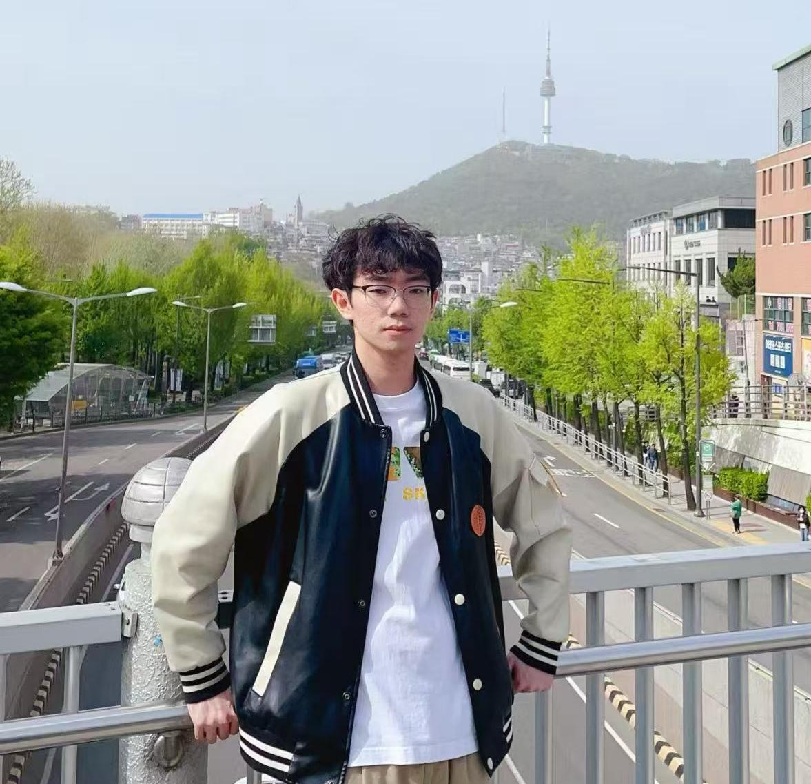

 

## 👨‍🎓 个人简介

  

    我是蔡铭修，目前在互联网公司担任大模型算法工程师。我于2025年6月硕士毕业，目前我的主要研究兴趣是<strong>多智能体系统</strong>、<strong>混合模态通讯</strong>、<strong>长上下文协同</strong>等。    
    我曾以第一作者在人工智能/自然语言处理等国际顶级会议发表文章。同时，我热衷于AI算法竞赛，曾获得国家级竞赛奖项三十余项。欢迎大家与我学术交流。
  

    
  

## 📖 教育经历

- *2022 - 2025*，东北大学，硕士学位，计算机科学与技术（保研）
- *2018 - 2022*，东北大学，学士学位，物联网工程

## 📝 发表论文

### 会议论文
- [EmpCRL: Controllable Empathetic Response Generation via In-Context Commonsense Reasoning and Reinforcement Learning](https://example.com). **Mingxiu Cai (蔡铭修)**, Daling Wang, Shi Feng, Yifei Zhang. *LREC-COLING* (**CCF-B**), 2024.
  
- [PECER: Empathetic Response Generation via Dynamic Personality Extraction and Contextual Emotional Reasoning](https://example.com). **Mingxiu Cai (蔡铭修)**, Daling Wang, Shi Feng, Yifei Zhang. *ICASSP* (**CCF-B**), 2024.

- [Generating Better Responses from User Feedback via Reinforcement Learning and Commonsense Inference](https://example.com). **Mingxiu Cai (蔡铭修)**, Daling Wang, Shi Feng, Yifei Zhang. *NLPCC* (**CCF-C**), 2023.

## 💼 实习经历

- *2024.5 - 2024.9*，网易（杭州）网络有限公司，伏羲人工智能实验室，文本大模型实习生
- *2024.2 - 2024.5*，小米科技有限责任公司，AI实验室，大模型算法实习生

## 🥇 获奖情况
### 科创竞赛

#### 2025年

- “华为云杯”2025人工智能OPC应用创新大赛 国家级三等奖
- Eduhacks 2025 国际大学生创客马拉松大赛 国家级一等奖
- 2025“大运河杯”数据开发应用创新大赛  国家级三等奖
- 英特尔平台企业AI解决方案创新实践赛  国家级三等奖
- 高德空间智能开发者大赛  优胜奖
- 2025百度商业AI技术创新大赛 - 搜索场景广告视频AIGC产品优化  优胜奖
- CCF大数据与计算智能大赛 - 面向大模型的形式化数学竞赛 优胜奖
- 2025动感地带AI+高校创智计划  华北赛区三等奖

#### 2024年
- **中国数字汽车大赛 国家级一等奖**
- 第三届"移动云杯"算力网络应用创新大赛 国家级二等奖
- **第七届世界智能大会·中国华录杯数据湖算法大赛 国家级二等奖**
- **第三届中国研究生"双碳"创新与创意大赛 国家级二等奖**
- **"松山湖杯"第一届中国研究生操作系统开源创新大赛 国家级三等奖**
- 2024年盐城数据创新应用大赛 国家级三等奖
- 2024年中信银行信用卡中心"星耀杯"金融创新挑战赛 国家级三等奖
- 2024年"竞技世界杯"中国大学生计算机博弈大赛 国家级三等奖
- 第十届全国大学生能源经济学术创意大赛 国家三等奖、东北赛区一等奖
- 2024年厦门市大数据创新应用大赛 · 地名地址空间聚类分析赛道 国家级三等奖
- 第四届中国移动"梧桐杯"大数据创新大赛 · 数据应用赛道 国家级优胜奖、区域赛一等奖
- "汇川杯"全国智能自动化创新大赛 东北赛区一等奖
- 2024 BOE全球校园创新挑战赛 东北赛区二等奖
- 2024年百度商业AI技术创新大赛 · 行业智能体搭建 东北赛区三等奖
- 第十七届全国大学生软件创新大赛 东北赛区三等奖

#### 2023年
- **"滨创杯"第九届中国研究生智慧城市技术与创意设计大赛 国家级一等奖**
- **2023年"竞技世界杯"中国大学生计算机博弈大赛 国家级一等奖**、国家级二等奖
- 第三届"欧冶云商杯"大学生编程&算法大赛 卓越奖（冠军）
- 2023年第九届3S杯大学生物联网技术与应用"三创"大赛 国家级三等奖
- 2023年第20届信息安全与对抗技术竞赛 国家级三等奖
- 2023年中软卓越杯技术大赛 国家级三等奖
- 第二届网易天工节能减碳开发者创新应用大赛 碳路者奖
- **2023华为开发者大赛 国家级三等奖**
- 2023"大运河杯"数据开发应用创新大赛 国家级三等奖
- 2023年广西公共数据开放创新应用大赛 国家级三等奖
- 第三届中国移动"梧桐杯"大数据创新大赛 · 技术开发赛道 国家级三等奖、区域赛一等奖
- 第二届"移动云杯"算力网络应用创新大赛 国家级三等奖、区域赛特等奖
- 2023年中国移动创客马拉松大赛 · 数智交通专题赛 国家级三等奖、toV突破奖
- 2023年中国移动创客马拉松大赛 · OneMO繁星闪烁物联网专题赛 国家级优秀奖
- 第七届全国大学生集成电路创新创业大赛 东北赛区二等奖
- 2023年中美青年创客大赛 沈阳赛区二等奖
- 2023年第十七届iCAN大学生创新创业大赛 辽宁赛区二等奖
- "正大杯"2023年大学生就业创业实战大赛 区域赛三等奖
- 第二届"创青春"中国青年碳中和创新创业大赛 东北赛区优胜奖
- 2023年"数智常州 便民利企"数字应用创新大赛 特别奖
- 第五届IAIC中国芯应用创新设计大赛 · 高校赛道 优秀奖
- 2023上海智能新能源汽车大数据竞赛 优秀奖
- 河南省数据应用创新大赛 优秀奖
- "先导杯"第一届智能车联网开放数据挑战赛 优秀奖
- 腾讯2023年LIGHT技术公益创造营 入围奖
- 锐捷网络星辰杯数通技术mini赛 优秀奖

#### 2022年
- **2022年"移动云杯"算力网络应用创新大赛 国家级一等奖**
- 2022年"竞技世界杯"中国大学生计算机博弈大赛 国家级二等奖
- 第十三届全国大学生过程装备实践与创新大赛 国家级二等奖
- **2022年全国大学生计算机设计大赛 国家级二等奖**、省级一等奖
- **"车谷杯"第九届中国研究生能源装备创新设计大赛 国家级二等奖**
- 2022年第十六届iCAN大学生创新创业大赛 国家级二等奖、省级一等奖
- 2022年第八届3S杯大学生物联网技术与应用"三创"大赛 国家级二等奖
- 首届大学生低碳循环科技创新大赛 国家级二等奖
- 第五届全国大学生可再生能源优秀科技作品竞赛 国家级二等奖
- 第三届全国智慧城市与智能建造大学生创新创业竞赛 国家二等奖
- "正大杯"2022年大学生就业创业实战大赛 总决赛铜奖、赛区一等奖
- 华为ICT大赛2022-2023中国区总决赛 国家级三等奖
- 第二届中国（重庆）国际物联网创新大赛 国家级三等奖
- 第十届"共享杯"科技资源共享服务创新大赛 国家级三等奖
- 2022年产业融合发展一新工科创新大赛 国家级三等奖
- 2022年讯飞A.I.开发者大赛-高校创新应用赛 全国八强
- "北控水务杯"第五届中国"互联网+"生态环境创新创业大赛 优秀奖
- 第二届边缘计算开发者大赛 全国优秀奖（全国二十强）
- 第四届辽宁省人工智能应用大赛 一等奖
- 2022年全国大学生光电设计竞赛 赛区二等奖
- 2022年中国TRIZ杯大学生创新方法大赛 省级二等奖
- 2022年中国高校计算机大赛-网络技术挑战赛 东北赛区二等奖
- 2022年"华为杯"全国大学生物联网设计竞赛 东北赛区二等奖
- 2022年第十七届全国环境友好科技竞赛 东北赛区二等奖
- 2022年第八届全国青年科普创新实验暨作品大赛 辽宁赛区二等奖
- 2022年中美青年创客大赛 沈阳赛区三等奖
- 第一届高校电气电子工程创新大赛 东北赛区三等奖
- 第一届"创青春"中国青年碳中和创新创业大赛 东北赛区铜奖

#### 2019-2021年
- 2021年全国大学生计算机设计大赛 国家级三等奖、省级二等奖
- 第十二届蓝桥杯全国软件和信息技术专业人才大赛 省级二等奖
- 2021年中国高校计算机大赛-网络技术挑战赛 东北赛区二等奖
- 2021年美国大学生数学建模竞赛 H奖
- 2020年"华为杯"全国大学生物联网设计竞赛 国家级二等奖、东北赛区特等奖
- 第三届全国大学生创新体验竞赛 国家级二等奖
- 2020年"高教社杯"全国大学生数学建模大赛 省级二等奖
- 2020年辽宁省大学生计算机系统与程序设计竞赛 二等奖
- 第十一届全国大学生数学竞赛 国家级二等奖、省级一等奖

### 奖学金
- 2024年 **硕士研究生国家奖学金**
- 2024年 东北大学硕士一等学业奖学金
- 2023年 **硕士研究生国家奖学金**
- 2023年 东北大学硕士一等学业奖学金
- 2022年 东北大学硕士一等学业奖学金
- 2022年 东北大学硕士推荐免试研究生校长奖学金
- 2021-2022年 东北大学2021-2022学年校级二等奖学金
- 2020-2021年 东北大学2020-2021学年校级一等奖学金
- 2020年 东北大学华为奖学金
- 2019-2020年 东北大学2019-2020学年校级二等奖学金
- 2018-2019年 东北大学2018-2019学年校级二等奖学金

### 荣誉称号
- **2025年《人民日报》研究生国家奖学金‌获奖学生代表（全校仅一项）**
- 2025届辽宁省普通高校优秀毕业生
- **2024年 东北大学"五四奖章"十佳研究生（全校仅十项）**
- 2024年 东北大学计算机科学与工程学院"CSE先锋个人"
- 2023-2024年 东北大学2023-2024学年优秀研究生
- 2022-2023年 东北大学2022-2023学年研究生单项荣誉-科技服务先进个人
- 2022-2023年 东北大学2022-2023学年优秀研究生
- 2020-2021年 东北大学2020-2021学年优秀学生标兵
- 2019-2020年 东北大学2019-2020学年优秀团员
- 2018-2019年 东北大学2018-2019学年优秀团员标兵

### 专利与其他
- 发明专利：《一种基于深度神经网络的上下文感知推荐方法》，第二发明人
- 发明专利：《一种内嵌的智能安防门锁及监控方法》，第四发明人
- 发明专利：《一种可组合式液态化学试剂管理盒系统》，第四发明人
- 平面设计类、产品设计类活动奖项20余项

## 📞 联系方式

**蔡铭修 (Achilles)**

**电话**: 187 3901 5876

**邮箱**: aa18739015876@163.com

**GitHub**: [链接](https://github.com/Achilles008)

